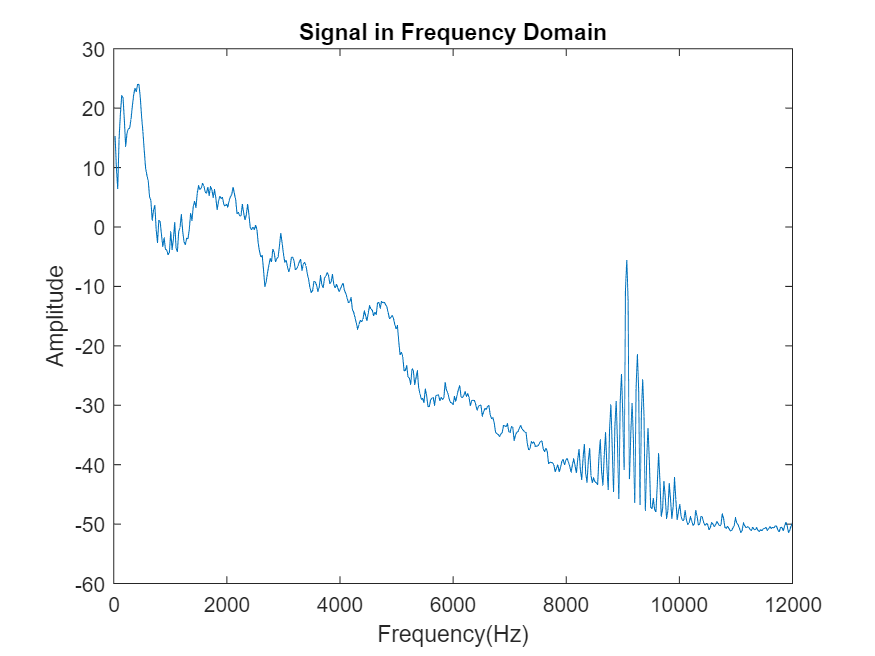
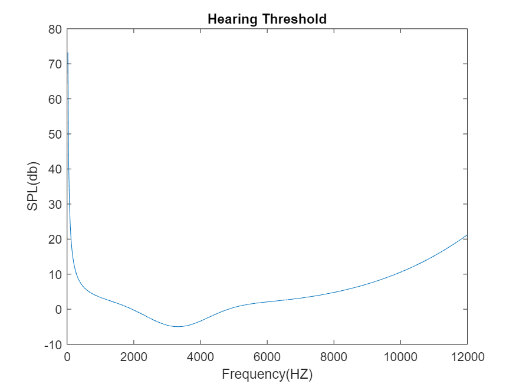
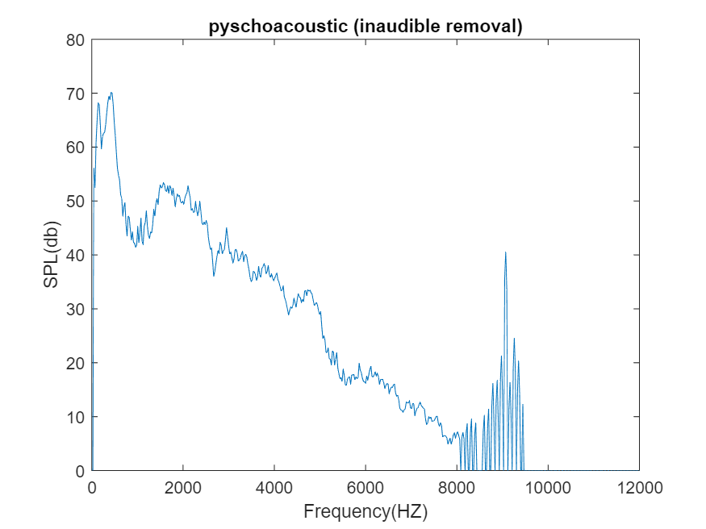
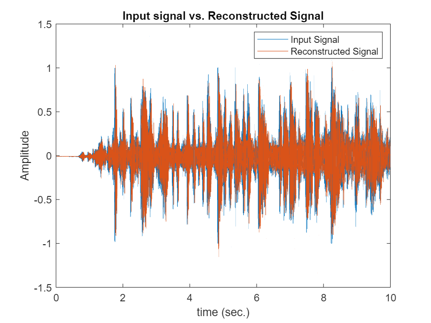

# 🎵 MPEG-Audio-Compression 🎶

This project focuses on implementing MPEG (Audio Compression) from scratch, encompassing crucial steps from filter bank construction to decoding.

## Steps:
1. **Building the Filter Bank and Frequency Domain Conversion**: The initial step involves constructing the filter bank and converting the signal into the frequency domain.
2. **Psychoacoustic Model**: This segment involves intricate processes such as removing inaudible frequencies and non-tonal frequencies to optimize compression without significant loss in perceived audio quality.
3. **Encoder**: The encoder undertakes tasks like FFT, magnitude spectrum extraction, bit allocation, and quantization to efficiently compress the audio signal.
4. **Decoder**: On the decoding end, the process involves dequantization, upsampling, and filtering to reconstruct the original audio signal from compressed data.

## Signal Analysis:

### Signal in Frequency Domain 

### Psychoacoustic Model:

#### Part 1: Inaudible Frequencies Removal
1. Initialization of arrays for loudness, hearing threshold, and frequency values.
2. Calculation of loudness using a psychoacoustic model and comparison with the hearing threshold.
3. Removal of frequencies below the hearing threshold.

#### Hearing Threshold

#### Signal after Inaudible Frequencies Removal

#### Part 2: Non-Tonal Frequencies Removal
1. Initialization of variables for original loudness values, global masking thresholds, and local maskers.
2. Identification and removal of global and local maskers.
3. Plotting the resulting psychoacoustic model with non-tonal removal.

#### Signal after Non-Tonal Frequencies Removal

### Compression Details:

#### Encoder
1. Performs FFT, extracts magnitude spectrum, and divides it into subbands.
2. Calculates information content within each subband based on loudness values and allocates bits accordingly.
3. Quantizes the output using the Quan function and returns relevant parameters.

#### Decoder
1. Dequantizes the signal using the DeQuan function.
2. Upsamples and filters the dequantized signals using synthesis filter bank coefficients.
3. Reconstructs the final signal from the filtered subbands.

## Results:

### Input vs. Reconstructed Signal

## Compression Ratio: [4:1]